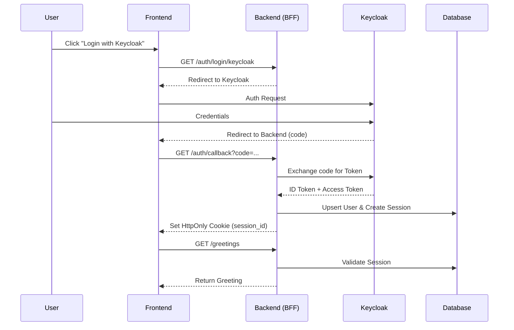

# Project: Auth Mastery

## 1. Purpose & Goals
The primary purpose of this project is to master advanced security concepts including:
- Password storage best practices (Hashing, Salting).
- Authentication & Authorization patterns.
- Mutual TLS (mTLS).
- OAuth 2.0 and OpenID Connect (OIDC).
- Session management (BFF Pattern).

## 2. Architecture Overview

### Components
1.  **Frontend ("Greetings"):** A React (Vite) web application.
2.  **Backend:** A FastAPI (Python) application acting as the primary API and Backend-for-Frontend (BFF).
3.  **Hello Service:** A Spring Boot application acting as a protected downstream resource.
4.  **Identity Provider:** A Keycloak instance.
5.  **Database:** PostgreSQL.

### High-Level Data Flow
1.  **User -> Frontend:** Users interact with the React UI.
2.  **Frontend -> Backend:** All API calls use a unified session-based authentication mechanism (HttpOnly Cookies).
3.  **Backend -> Database:** Stores local user credentials (hashed/salted), user preferences, and active session data.
4.  **Backend -> Keycloak:** Used for OIDC authentication (Authorization Code Flow) to verify identities.
5.  **Backend -> Hello Service:**
    -   **Transport:** Secured via mTLS (Mutual TLS).
    -   **Authorization:** Implicit via mTLS (Identity is proof of authorization for this internal service).

### Sequence Diagram: Unified Session (OIDC Flow)

## 3. Detailed Requirements

### 3.1 Frontend ("Greetings")
**Tech Stack:** React, Vite.

**Screens:**
1.  **Landing Page:**
    -   Login button (redirects to Login Screen).
    -   Sign Up button (redirects to Sign Up Screen).
    -   "Login with Keycloak" button (initiates OIDC flow).
2.  **Sign Up Screen:**
    -   Inputs: Name, Email, Password.
    -   Action: Creates a local user in Postgres.
3.  **Login Screen:**
    -   Inputs: Email, Password.
    -   Action: Authenticates against local Postgres.
4.  **Home Screen (Protected):**
    -   Displays a personalized greeting (e.g., "Hello, [Name]").
    -   **Navigation Bar:**
        -   Left: Back button (history), Logo (links to Home).
        -   Right: Preferences, Logout.
5.  **Preferences Page (Protected):**
    -   **Link Social Media:** Allows linking the current account with a Keycloak identity.
    -   **Change Greeting:** Dropdown list to select preferred greeting style.
    -   **Change Password:** Available only for users with a local password.
    -   **Verify Email:** Available only for users who haven't verified yet (non-OAuth).

### 3.2 Backend (FastAPI)
**Tech Stack:** Python, FastAPI, SQLModel/SQLAlchemy.

**Responsibilities:**
-   **Auth Management:**
    -   **Unified Session Management:** Implement a BFF pattern where both local login and OIDC login result in the same server-side session (cookie-based).
    -   **Password Security:** Passwords must be hashed (e.g., Argon2) and salted before storage.
    -   **OIDC Integration:** Handle the authorization code flow with Keycloak.
    -   **Account Linking:** Enforce "Login First" policy. Users must be authenticated to link a Keycloak identity.
-   **Proxying:**
    -   Call the "Hello Service" to fetch greeting data.
    -   Establish mTLS connection to "Hello Service".

### 3.3 Hello Service (Spring Boot)
**Tech Stack:** Java, Spring Boot.

**Responsibilities:**
-   Expose a simple "Hello World" endpoint.
-   **Security:**
    -   Require mTLS for all incoming connections.

### 3.4 Database (PostgreSQL)
**Schema Design:**

1.  **`users` Table:**
    -   `id` (Primary Key, UUID)
    -   `email` (Unique, String)
    -   `password_hash` (String, Nullable) - Stores the Argon2 hash (includes salt).
    -   `full_name` (String)
    -   `is_verified` (Boolean) - Tracks local email verification status.
    -   `created_at` (Timestamp)

2.  **`federated_identities` Table:**
    -   `id` (Primary Key)
    -   `user_id` (Foreign Key -> users.id)
    -   `provider` (String) - e.g., "keycloak".
    -   `subject_id` (String) - The unique user ID from the provider.
    -   `created_at` (Timestamp)
    -   *Constraint:* Unique combination of (provider, subject_id).

3.  **`preferences` Table:**
    -   `id` (Primary Key)
    -   `user_id` (Foreign Key -> users.id, Unique)
    -   `greeting_style` (String) - e.g., "formal", "casual".
    -   `theme` (String) - e.g., "light", "dark".

4.  **`sessions` Table:**
    -   `id` (Primary Key, String) - The session ID sent in the HttpOnly cookie.
    -   `user_id` (Foreign Key -> users.id)
    -   `expires_at` (Timestamp)
    -   `created_at` (Timestamp)

### 3.5 API Contract (High Level)
To ensure decoupling between Frontend and Backend, the following endpoints are proposed:

-   **Auth:**
    -   `POST /api/auth/signup`: Create local account.
    -   `POST /api/auth/login`: Local login (returns cookie).
    -   `GET /api/auth/keycloak/login`: Initiates OIDC flow.
    -   `GET /api/auth/keycloak/callback`: Handles OIDC redirect.
    -   `POST /api/auth/logout`: Destroys session.
    -   `GET /api/auth/me`: Returns current user context.
-   **Features:**
    -   `GET /api/greetings`: Fetches greeting from Hello Service.
    -   `PUT /api/users/preferences`: Updates greeting style/theme.
    -   `POST /api/users/link-social`: Initiates linking flow.

### 3.6 Configuration & Environment
The system requires the following environment variables:
-   **Database:** `POSTGRES_USER`, `POSTGRES_PASSWORD`, `POSTGRES_DB`, `POSTGRES_HOST`.
-   **Keycloak:** `OIDC_CLIENT_ID`, `OIDC_CLIENT_SECRET`, `OIDC_DISCOVERY_URL`.
-   **Security:** `SESSION_SECRET_KEY`, `MTLS_CLIENT_CERT_PATH`, `MTLS_CLIENT_KEY_PATH`.

## 4. Future Scope / Stretch Goals
-   **Passkeys:** Implement WebAuthn/Passkeys for passwordless login.
-   **Account Linking:** Robust handling of merging local and OAuth accounts based on email trust.